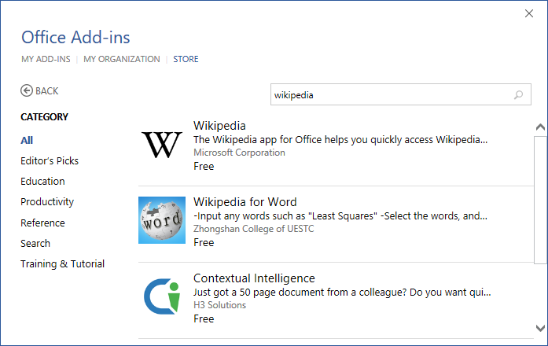

Lab 01 - Aplikace pro Office pohledem uživatele
====

Cílem tohoto cvičení je podívat se na to, jak vypadají a jak se používají aplikace pro Office, kolem kterých se točí celý Dev Camp.

## SharePoint

1. Přihlašte se svým administrátorským účtem Office 365 na `https://[tenant].sharepoint.com`.
1. Klikněte na **Site Contents** v levém panelu.
1. Vyberte **Add an app**.
1. Vlevo klikněte na **SharePoint Store**.
	
	
	
1. Do políčka vyhledávání napište **napa** a potvrďte.
1. Portál najde aplikaci **"Napa" Office 365 Development Tools**.

	
	
1. Klikněte na ni a prohlédněte si detail aplikace.
	1. screenshoty
	1. popis
	1. recenze
	1. permissions

	

1. Vyberte **ADD IT** a potvrďte, že jí věříte tlačítkem **Trust it**.
1. Automaticky se vrátíte na SharePoint, kde se aplikace aktivně instaluje.

	

1. Jakmile instalace skončí, můžete aplikaci spustit.

	

1. Přesměruje vás na napacloudapp.com, ale zachová si povědomí o kontextu SharePointu.

	

> Aplikaci Napa jsme neinstalovali náhodou, slouží totiž jako webové vývojové prostředí pro aplikace Office. Můžete tak jednoduše programovat i bez Visual Studia. Určitě ji prozkoumejte.

## Word

1. Spusťte Word 2013 nebo 2016 a zvolte nový **prázdný dokument**.
1. Přejděte na kartu **Insert** (**Vložení**) a zvolte **Store**.
1. Vyhledejte aplikaci **Wikipedia**. Pokud není vidět přímo, použijte vyhledávací políčko.

	

1. Klikněte na ni a prohlédněte si detail.
	1. hodnocení
	1. oprávnění
1. Klikněte na zelené tlačítko **Trust it**.
1. Aplikace se automaticky spustí.

	

1. Zkuste vyhledat například **Azure**.
1. Klikněte na **Expand** a poté **Microsoft Azure**.
1. Všimněte si, jak probíhá navigace uvnitř add-inu a jak je obsah formátovaný.
1. Vyberte část textu a klikněte na tlačítko **+**, které se objevilo nad ním.
1. Text se spolu s citací vložil do dokumentu.

	

## Excel

1. Spusťte Excel 2013 nebo 2015 a zvolte nový **prázdný dokument**.
1. Připravte jednoduchá testovací data.

 |Rok|Množství|
 |---|---|
 |2011|23|
 |2012|34|
 |2013|12|
 |2014|21|
 |2015|10|

1. Klikněte na kartu **Insert** a poté **Store**.
1. Vyhledejte aplikaci **People Graph** a přidejte ji stejným způsobem jako u Wordu.

	

1. Aplikace se spustí přímo v sešitu.
1. Klikněte na ikonu tabulky (**Data**).

	

1. Označte testovací data v sešitu a klikněte na tlačítko **Select your data**.
1. Potvrďte **Create**.

	

1. Když si pohrajete s nastavením, můžete mít nakonec třeba takovou infografiku:

	