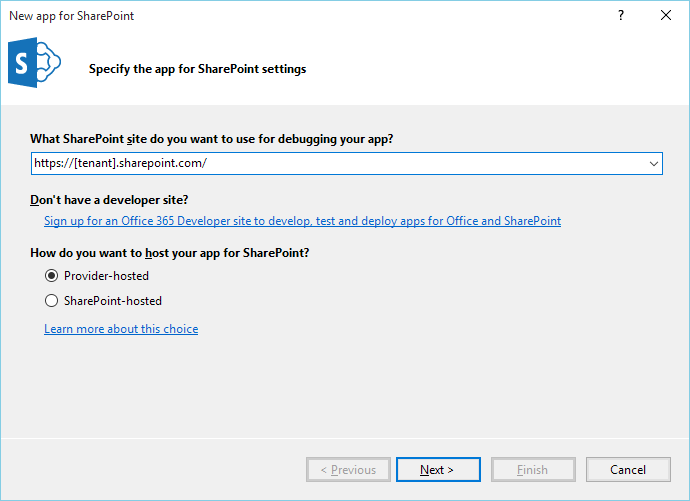
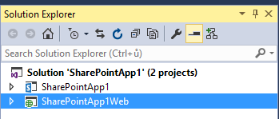
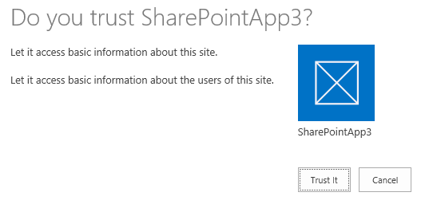
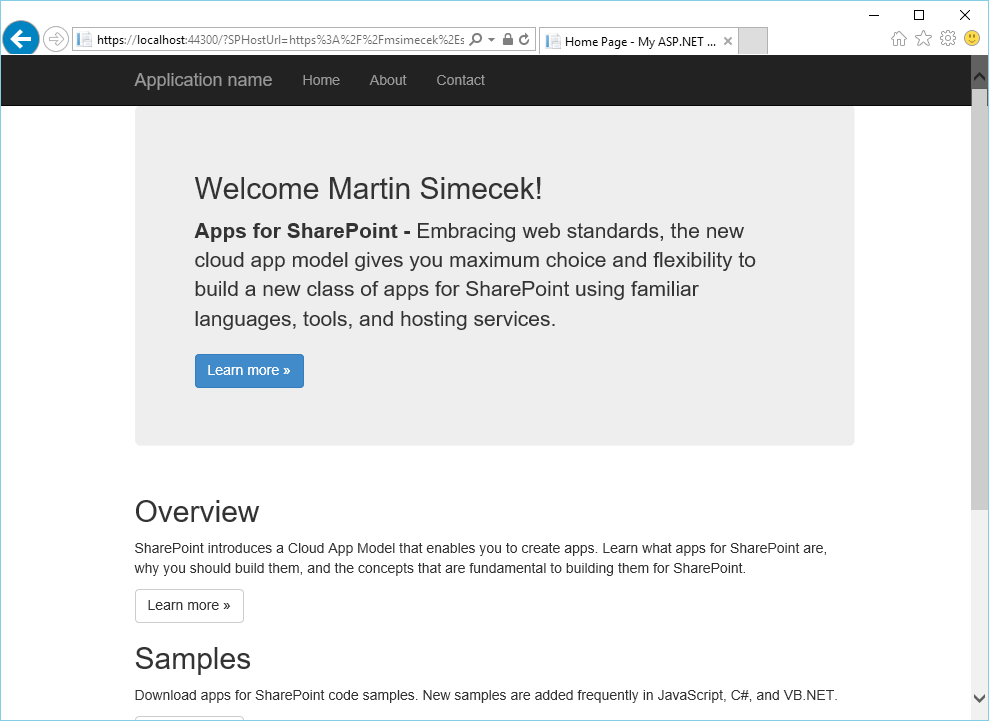
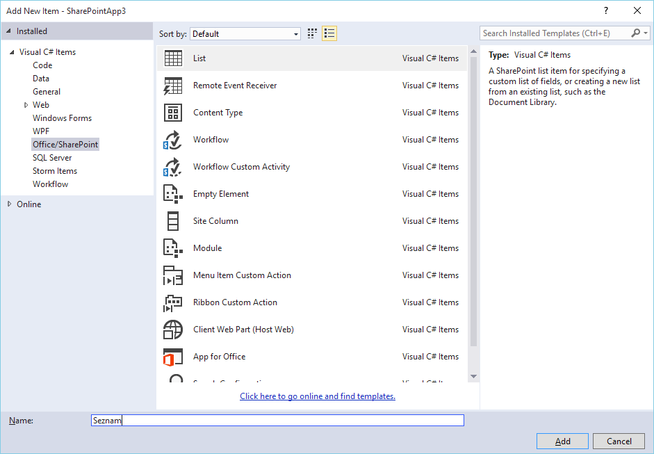
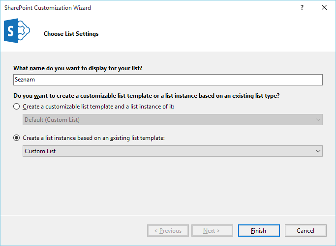
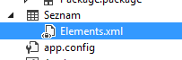
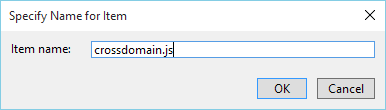
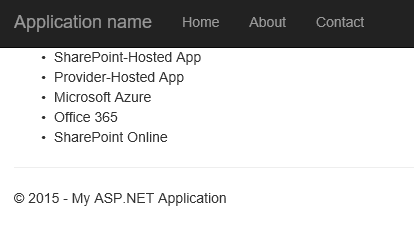

Lab 02 - Cross-Domain volání a provider-hosted app
===

V tomto cvičení vytvoříme jednoduchou Provider-Hosted aplikaci, jejíž součástí bude App Web a načítání dat pomocí JavaScriptu napříč doménami.

## Nový SharePoint add-in

1. Spusťte Visual Studio a zvolte **File &rarr; New &rarr; Project**.
1. Z nabídky typů projektů vyberte **Office/SharePoint** a následně **App for SharePoint**.
1. Vyplňte URL svého webu SharePoint Online. Typicky to bude *[tenant].sharepoint.com*, kde [tenant] nahradíte názvem svého tenantu.

	
	
1. Přepínátko nechte na **Provider-hosted**.
1. Visual Studio vás vyzve k přihlášení. Použijte svůj účet administrátora Office 365 (*[jméno]@[tenant].onmicrosoft.com*).
1. Vyberte **SharePoint Online** a pokračujte **Next >**.
1. Vyberte **ASP.NET MVC Web Application** a pokračujte **Next >**.
1. Ponechte nastavení **Use Windows Azure Access Control Service** a ukončete průvodce **Finish**.

Visual Studio nyní vytvoří Solution s dvěma projekty: aplikací pro SharePoint a webem.



1. Spusťte aplikaci tlačítkem **Start** (nebo **Debug &rarr; Start Debugging**).
1. Pokud se vše podaří, budete se muset přihlásit a následně stvrdit, že aplikaci věříte.

	
	
1. Poté se již otevře stránka s vaším jménem.

	
	
1. Ověřili jsme, že aplikace funguje, takže ji můžeme zase ukončit.

## Cross-Domain Library

Vytvoříme list v app webu a pak na něj přistoupíme ze vzdáleného webu (resp. provider-hosted aplikace).

1. Klikněte pravým tlačítkem na projekt s aplikací pro SharePoint (nikoliv web) a zvolte **Add &rarr; New Item**.
1. Zvolte typ **List** a pojmenujte jej **Seznam**.

	

1. Vyberte **Create a list instance based on an existing list template** a v rozbalovátku **Custom List**.

	
	
1. Dokončete průvodce tlačítkem **Finish**.
1. Otevřete soubor **Elements.xml**, který se rozbalil v Solution Exploreru pod novým seznamem.

	
	
1. Do elementu `<ListInstance>` vložte následující:

	```xml
	 <Data>
		<Rows>
			<Row>
			<Field Name="Title">SharePoint-Hosted App</Field>
			</Row>
			<Row>
			<Field Name="Title">Provider-Hosted App</Field>
			</Row>
			<Row>
			<Field Name="Title">Microsoft Azure</Field>
			</Row>
			<Row>
			<Field Name="Title">Office 365</Field>
			</Row>
			<Row>
			<Field Name="Title">SharePoint Online</Field>
			</Row>
		</Rows>
	</Data>
	```
	
1. Klikněte pravým tlačítkem na složku **Scripts** v druhém projektu (webové aplikaci) a zvolte **Add &rarr; JavaScript file**.
1. Pojmenujte jej **crossdomain.js** a potvrďte **OK**.

	

1. Naplňte jej skriptem:

	```javascript
	(function () {
		"use strict";
	
		jQuery(function () {
	
			//Get Host and App web URLS
			var appWebUrl = "";
			var spHostUrl = "";
			var args = window.location.search.substring(1).split("&");
	
			for (var i = 0; i < args.length; i++) {
				var n = args[i].split("=");
				if (n[0] == "SPHostUrl")
					spHostUrl = decodeURIComponent(n[1]);
			}
	
			for (var i = 0; i < args.length; i++) {
				var n = args[i].split("=");
				if (n[0] == "SPAppWebUrl")
					appWebUrl = decodeURIComponent(n[1]);
			}
	
			//Load Libraries
			var scriptbase = spHostUrl + "/_layouts/15/";
	
			jQuery.getScript(scriptbase + "SP.RequestExecutor.js", function (data) {
	
				//Call Host Web with REST
				var executor = new SP.RequestExecutor(appWebUrl);
				executor.executeAsync({
					url: appWebUrl + "/_api/web/lists/getbytitle('Seznam')/items",
					method: "GET",
					headers: { "accept": "application/json;odata=verbose" },
					success: function (data) {
	
						var results = JSON.parse(data.body).d.results;
						for (var i = 0; i < results.length; i++) {
							$("#seznam").append("<li>" + results[i].Title + "</li>");
						}
					},
					error: function () {
						alert("Error!");
					}
				});
	
			});
	
		});
	}());
	```

1. Otevřete soubor **Views/Shared/_Layout.aspx**.
1. Těsně před `</body>` přidejte:

	```html
	<script src="~/Scripts/crossdomain.js"></script>
	```
	
1. Nahraďte obsah souboru **Views/Home/Index.cshtml** kódem:

	```
	@{
		ViewBag.Title = "Home Page";
	}
	
	<ul id="seznam">
	
	</ul>
	```

1. Spusťte aplikaci.

Jakmile se stránka načte, nastane drobná prodleva, během které se JavaScript připojí na SharePoint a přečte z něj seznam. Následně ho zobrazí.

