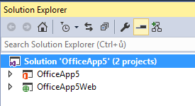
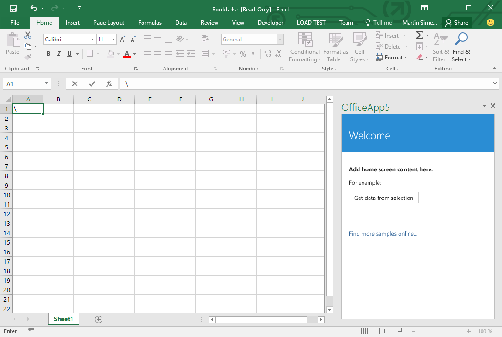
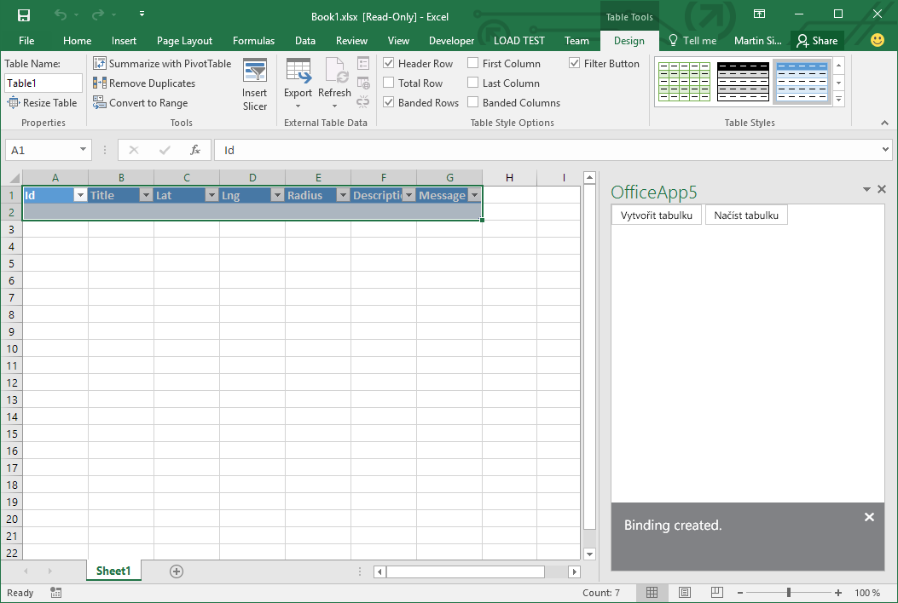
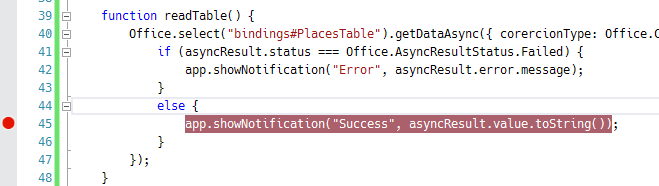
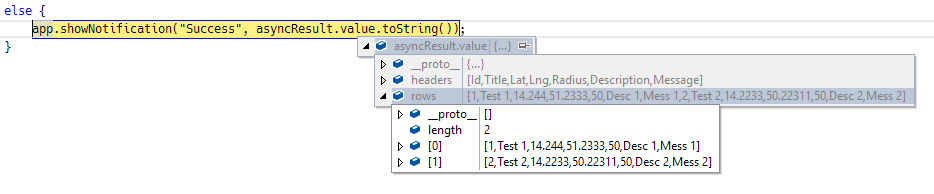

Lab 05 - aplikace pro Excel
===

1. Spusťte Visual Studio a zvolte **File &rarr; New &rarr; Project**.
1. V sekci **Office/SharePoint &rarr; Apps** vyberte **App for Office**.
1. Jako typ aplikace ponechte **Task Pane**.
1. V seznamu klientů odškrtněte všechny kromě **Excel**.
1. Potvrďte **Finish**.

Visual Studio vytvoří Solution s dvěma projekty: Office app s manifestem a webovou aplikaci.



1. Klikněte na **Start** (případně **Debug &rarr; Start Debugging**).
1. Spustí se Excel s prázdným dokumentem a po pravé straně bude mít panel s naší novou aplikací.



Základní šablona obsahuje tlačítko, které přečte, co je zrovna v sešitu označeno, a zobrazí to. My vytvoříme o málo složitější funkcionalitu.

1. Otevřete soubor **Home.html** a nahraďte obsah `<body> ... </body>` tímto HTML:

	```html
	<button id="createTable" class="ms-Button ms-Button--primary">
    	<span class="ms-Button-label">Vytvořit tabulku</span>
	</button>
	
	<button id="readTable" class="ms-Button ms-Button--primary">
        <span class="ms-Button-label">Načíst tabulku</span>
    </button>
	```
	
	> Nenechte se zatím rozhodit zaobalením do podivných CSS tříd, dojde na ně později.
	
1. Nyní otevřete soubor **Home.js** a změňte tento řádek:
	
	```javascript
	$('#get-data-from-selection').click(getDataFromSelection);
	```
	
	Takto:
	
	```javascript
    $("#createTable").click(createTable);
    $("#readTable").click(readTable);
	```
	
1. Nad funkci `getDataFromSelection` přidejte kostru obsluhy kliknutí na tlačítko `createTable`:

	```javascript
	function createTable() {
		
	}
	```
	
1. Nyní budeme tuto funkci postupně plnit.
1. Začneme definicí tabulky:

	```javascript
	var table = new Office.TableData();
	table.headers = [
		['Id', 'Title', 'Lat', 'Lng', 'Radius', 'Description', 'Message']
	];
	```
	
1. A poté použijeme API metodu `setSelectedDataAsync` k vložení tabulky do sešitu.

	```javascript
	Office.context.document.setSelectedDataAsync(table, { coercionType: Office.CoercionType.Table }, function (asyncResult) {
		if (asyncResult.status == "failed") {
			app.showNotification('Action failed with error: ' + asyncResult.error.message);
		}
		else {
			Office.context.document.bindings.addFromSelectionAsync(Office.BindingType.Table, { id: "PlacesTable" }, function (asyncResult) {
				if (asyncResult.status == "failed") {
					app.showNotification("Action failed with error: " + asyncResult.error.message);
				}
				else {
					app.showNotification("Binding created.");
				}
			})
		}
	});
	```
	
	Všimněte si, že používáme `coercionType: Office.CoercionType.Table`. Říkáme tím Excelu, že data, která vkládáme, jsou tabulkou, takže dostanou zvláštní péči (například obarvení, automatické natahování podle řádků, filtry apod.).
	
1. Funkci `getDataFromSelection` můžete smazat.
1. Soubor Home.js by měl nyní celý vypadat takto:

	```javascript
	/// <reference path="../App.js" />
	
	(function () {
		"use strict";
	
		// The initialize function must be run each time a new page is loaded
		Office.initialize = function (reason) {
			$(document).ready(function () {
				app.initialize();
	
				$("#createTable").click(createTable);
			    $("#readTable").click(readTable);
			});
		};
	
		function createTable() {
			var table = new Office.TableData();
			table.headers = [
				['Id', 'Title', 'Lat', 'Lng', 'Radius', 'Description', 'Message']
			];
	
			Office.context.document.setSelectedDataAsync(table, { coercionType: Office.CoercionType.Table }, function (asyncResult) {
				if (asyncResult.status == "failed") {
					app.showNotification('Action failed with error: ' + asyncResult.error.message);
				}
				else {
					Office.context.document.bindings.addFromSelectionAsync(Office.BindingType.Table, { id: "PlacesTable" }, function (asyncResult) {
						if (asyncResult.status == "failed") {
							app.showNotification("Action failed with error: " + asyncResult.error.message);
						}
						else {
							app.showNotification("Binding created.");
						}
					})
				}
			});
		}
	
	})();
	```
	
Když teď aplikaci spustíte a kliknete na tlačítko, do sešitu se vloží tato tabulka:



Nyní obsloužíme čtení dat z tabulky.

1. Pod funkci `createTable` přidejte kostru funkce `readTable`:

	```javascript
	function readTable() {
		
	}
	```

1. Dovnitř vložte čtení tabulky pomocí funkce `Office.select()`, která umí sáhnout přímo na konkrétní binding - v našem případě `PlacesTable`:
	
	```javascript
	function readTable() {
        Office.select("bindings#PlacesTable").getDataAsync({ corercionType: Office.CoercionType.Table }, function (asyncResult) {
            if (asyncResult.status === Office.AsyncResultStatus.Failed) {
                app.showNotification("Error", asyncResult.error.message);
            }
            else {
                app.showNotification("Success", asyncResult.value.toString());
            }
        });
    }
	```
	
	Opět používáme `Office.CoercionType.Table`.
	
1. Přidejte breakpoint na řádek `app.showNotification("Success", asyncResult.value.toString());`. 

	
	
1. Spusťte aplikaci.
1. Vytvořte tabulku prvním tlačítkem a vyplňte do ní několik řádků.
1. Klikněte na druhé tlačítko (**Načíst tabulku**).
1. Aplikace se zastaví na breakpointu. Nyní můžete myší najet nad `value`, kliknout na šipku a poté **rows**. Uvidíte obsah tabulky načtený jako javascriptové pole.

	

## Office Fabric

Funkční část add-inu je v rámci tohoto cvičení hotová, nyní ho ještě uděláme přívětivější pro oko.

1. Otevřete soubor **Home.html** a do hlavičky nad `<link href="../App.css" rel="stylesheet" type="text/css" />` přidejte:

	```html
	<link rel="stylesheet" href="//appsforoffice.microsoft.com/fabric/1.0/fabric.min.css">
    <link rel="stylesheet" href="//appsforoffice.microsoft.com/fabric/1.0/fabric.components.min.css" />
	```
	
1. Spusťte aplikaci.

Z CDN se stáhne definice stylů tzv. **Office UI Fabric**. Tyto styly přesně odpovídají designu aplikací Office a SharePointu. Jsou [open-source](https://github.com/OfficeDev/Office-UI-Fabric) a existuje k nim i [web s ukázkami](http://officeuifabric.com/).